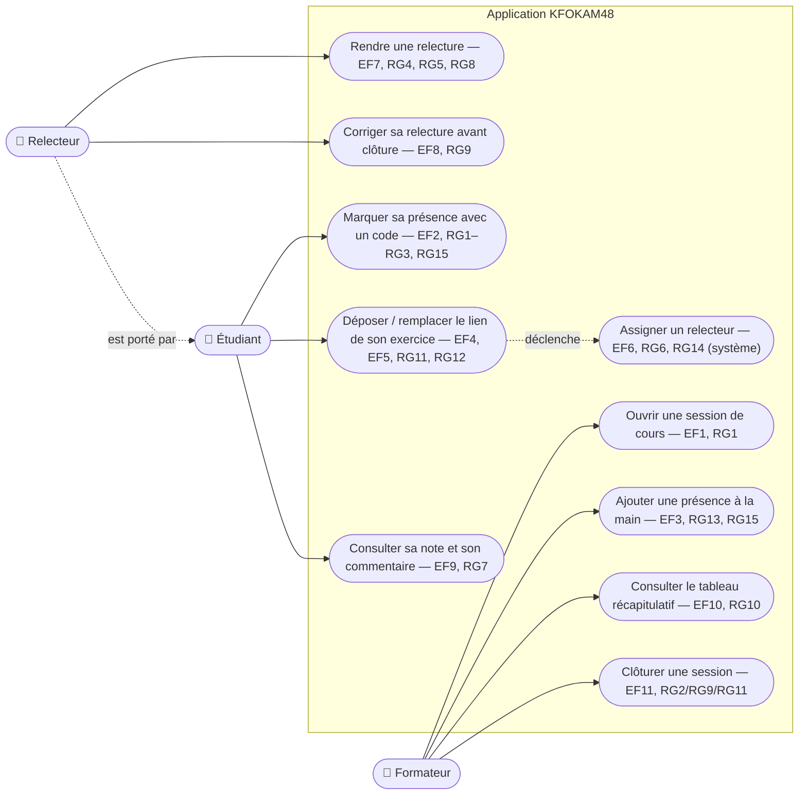

# D1 — Cas d'utilisation

> Acteurs et ce que chacun peut faire. Les cas « système » (assignation du relecteur, EF6) sont déclenchés par la postcondition du dépôt d'exercice, conformément à la note de modélisation du backlog. Les renvois EFx/RGx sont ceux du cahier des charges v1.1.

**Lecture :**
- Le **relecteur** n'est pas un compte distinct : c'est un étudiant dans un état (assigné sur un exercice précis, jamais le sien — RG4). D'où la relation pointillée « est porté par ».
- L'**assignation** (UC5) n'a pas d'acteur humain : elle est déclenchée automatiquement par la postcondition du dépôt (UC4 → UC5), décision documentée dans la note de modélisation du backlog.
- Le formateur n'accède pas directement à UC5/UC6/UC7 : le choix du relecteur appartient au système (Q7), la note appartient au relecteur.
