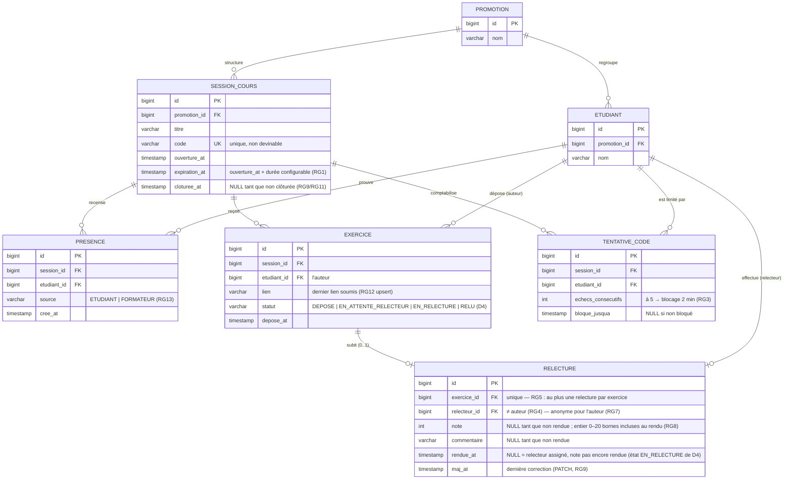

# D2 — Modèle de données (classes)

> Entités, attributs et cardinalités. **Ce diagramme doit correspondre aux migrations Flyway** : la migration `V1` crée `promotion`, `etudiant`, `session_cours`, `presence`, `exercice`, `relecture` et la table de suivi `tentative_code` (RG3). Les contraintes d'unicité matérialisent RG15, RG5 et l'unicité (session, auteur).

**Contraintes d'unicité (matérialisées en base) :**

| Contrainte | Colonnes | Règle source |
|---|---|---|
| UK1 | `session_cours.code` | code unique par session (EF1) |
| UK2 | `presence (session_id, etudiant_id)` | RG15 — une seule présence par session |
| UK3 | `exercice (session_id, etudiant_id)` | un seul exercice par (session, auteur) — support de l'upsert RG12 |
| UK4 | `relecture.exercice_id` | RG5 — au plus un relecteur par exercice |
| UK5 | `tentative_code (session_id, etudiant_id)` | RG3 — un compteur par (session, étudiant) |

**Lecture :**
- `EXERCICE.etudiant_id` (l'auteur) et `RELECTURE.relecteur_id` sont deux rôles du même `ETUDIANT` : une contrainte applicative (service, RG4) interdit `relecteur_id = exercice.etudiant_id` — elle ne peut pas s'exprimer comme une simple clé étrangère.
- `SESSION_COURS.cloturee_at` nullable est le pivot des verrouillages RG2/RG9/RG11.
- Le statut de l'exercice est dérivable (`EN_RELECTURE` ⇔ relecture existante non rendue, etc.) mais stocké pour refléter D4 et simplifier le tableau.
- **Correction v1.2** : la ligne `relecture` est créée **à l'assignation** (RG14), avec `note`/`commentaire`/`rendue_at` nullables — c'est ce qui rend l'état `EN_RELECTURE` de D4 persistant. Le rendu (EF7) remplit `note`, `commentaire` et `rendue_at` ; contrainte de cohérence en base : `rendue_at IS NULL OR note IS NOT NULL`. Aucune décision client (Qx/RGx) n'est modifiée par cette correction — c'est une cohérence interne entre D2 et D4.
