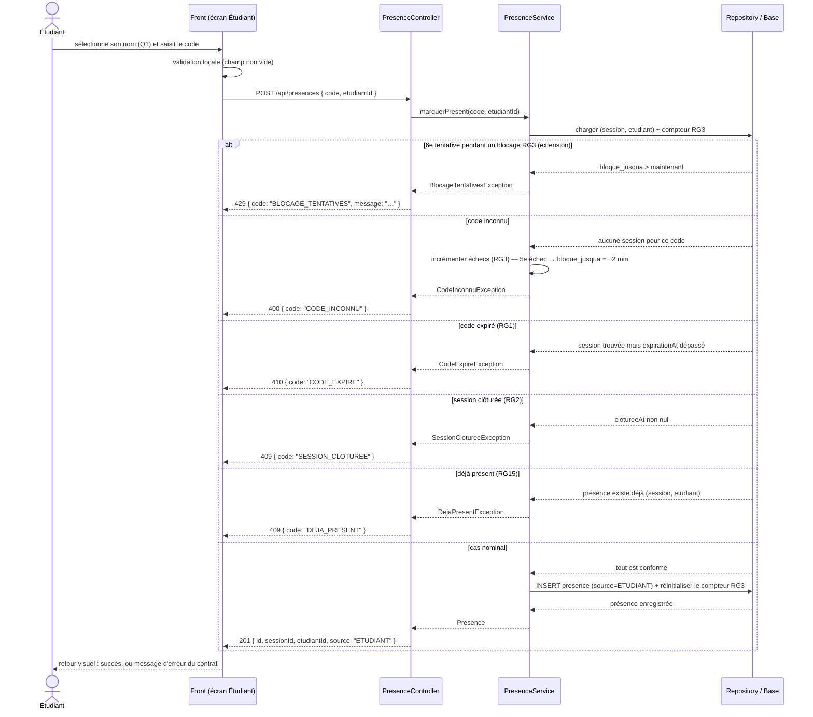

# D3 — Séquence : « marquer sa présence »

> Cas nominal et cas d'erreur. **Les codes HTTP correspondent exactement au contrat** (`POST /api/presences` : 201 · 400 CODE_INCONNU · 409 DEJA_PRESENT · 410 CODE_EXPIRE · et l'extension 429 BLOCAGE_TENTATIVES, RG3).

**Lecture :**
- Le contrôleur ne fait rien d'autre que déléguer et traduire l'exception métier en réponse HTTP (B3/B4) — la logique et les règles RG1/RG2/RG3/RG15 vivent dans le service ; les codes HTTP sont décidés dans le `@RestControllerAdvice` à partir du type d'exception.
- L'ordre des vérifications est important et testable : blocage RG3 d'abord (refus sans même regarder le code), puis existence du code (400), puis expiration (410), puis clôture (409), puis unicité (409). Un échec de code inconnu alimente le compteur RG3 ; les autres refus non plus.
- Ce diagramme correspond au flux détaillé du ticket US-02 et sera re-vérifié si l'enveloppe (étape 3) modifie le besoin.
