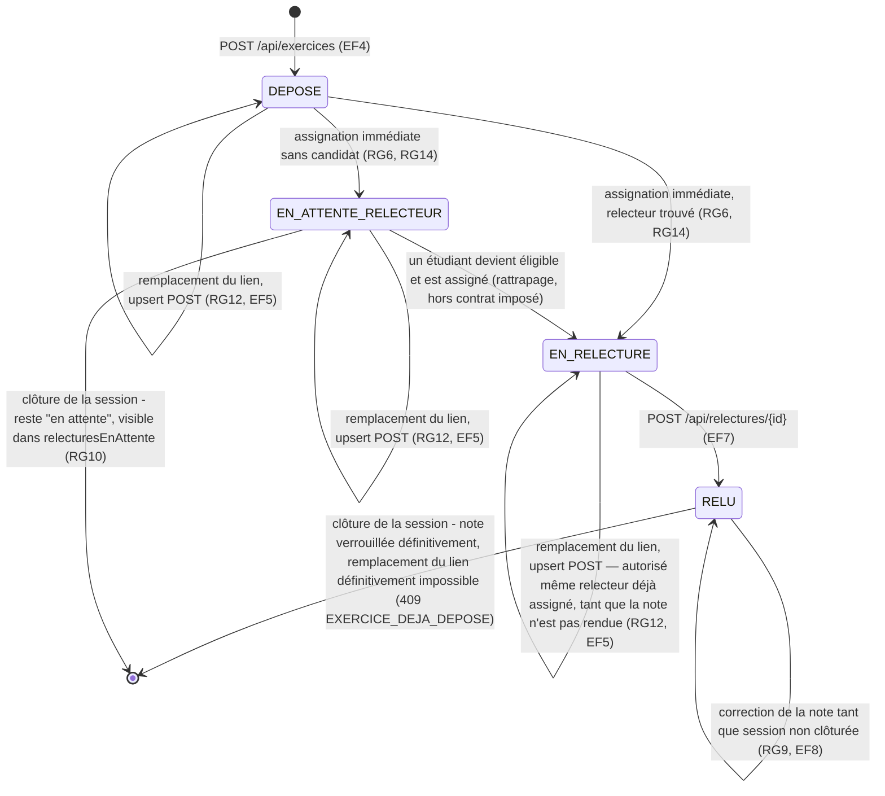

# D4 (bonus +3) — États-transitions du cycle de vie d'un exercice

**Lecture :** le seuil de blocage du remplacement (RG12) est le passage à `RELU`, pas l'assignation du relecteur. Un exercice `EN_RELECTURE` reste donc remplaçable — l'assignation étant immédiate (RG14), bloquer dès `EN_RELECTURE` aurait rendu Q13 inapplicable en pratique. Le remplacement ne modifie ni `id` ni le statut de l'exercice ; si un relecteur était déjà assigné, il le reste et continue de voir le nouveau lien.
